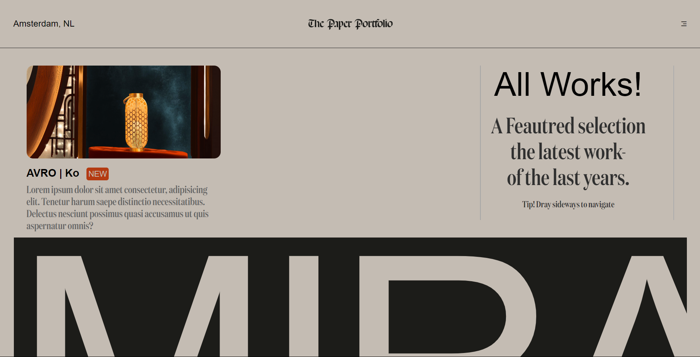
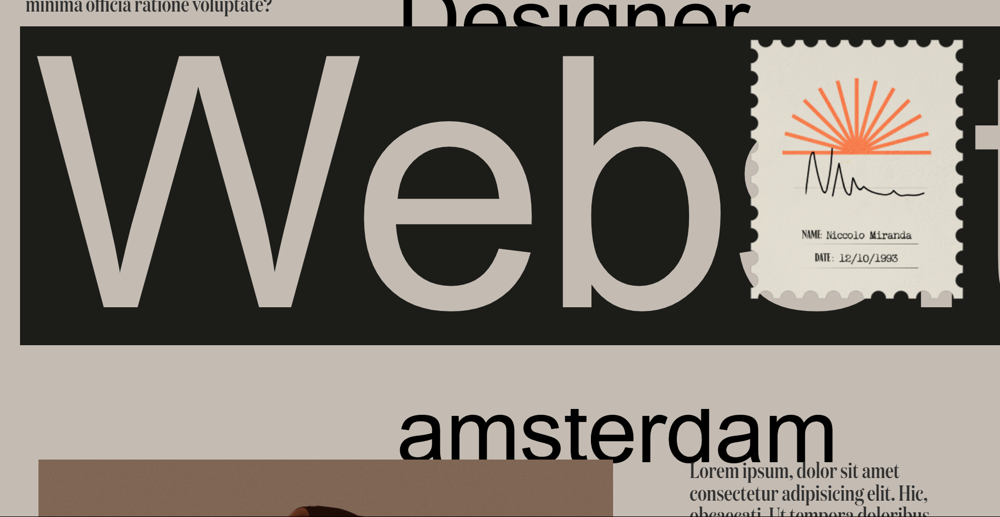
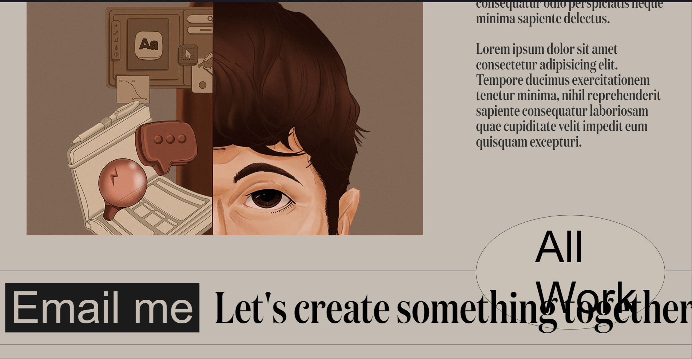

# Miranda Website Using Locomotive JS

This is a clone of the **Miranda** website built as a single-page website. It showcases the use of **Locomotive.js** for smooth scrolling and animations, with basic **HTML**, **CSS**, and **JavaScript**.









## Features

- **Locomotive.js** for smooth scrolling and animations.
- Clean and simple single-page layout.
- Responsive design using CSS for various screen sizes.

## Technologies Used

- **HTML**: For the structure of the webpage.
- **CSS**: For styling and layout.
- **JavaScript**: For interaction and dynamic effects.
- **Locomotive.js**: To add smooth scrolling and animations.

## Installation and Setup

1. Clone the repository:

   ```bash
   git clone https://github.com/Joyxpro/MIRANDA-LOCOMOTIVE-JS.git
   ```


2. Navigate to the project directory:
    ```bash
    cd miranda-website-clone
    ```

3. Open the ```index.html``` file in your browser to view the website locally.

## Usage

- Browse through the single-page website to see the Locomotive.js scrolling effects in action.

- Modify the HTML, CSS, or JavaScript to customize the content and appearance as needed.

